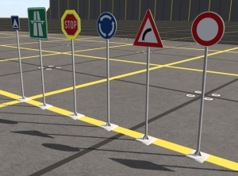
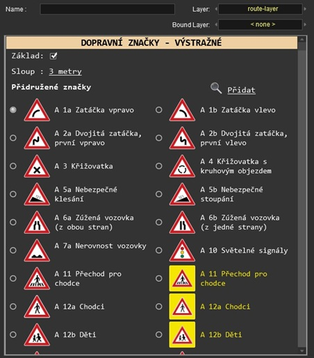

# Trainz Road Signs [CZ]
Trainz Script code for Czech road signs used in Trainz Simulator games.

  

## Description

Script code is a part of a package that consists of scripts and models.
The whole package is available to freely download here: [http://www.glocky-trainz.funsite.cz](http://www.glocky-trainz.funsite.cz/download/scenery/scen95.php).
There are currently 6 place-able sign types (kuids), each can have multiple types, totalling 114 different signs avaiable to display.
This code is publicly accessible and modifiable. If you have suggestions, feel free to fork and create pull request - your changes / fixes might get into future releases.
The HTML interface uses Czech language.

## Getting Started

### Dependencies

* Targeted **Trainz Simulator 2019**
* Compatible with **Trainz: A New Era**
* Meshes, entire road sign CDP packages: [http://www.glocky-trainz.funsite.cz](http://www.glocky-trainz.funsite.cz/download/scenery/scen95.php)

### Installing

* Download it on page linked above and install into Trainz content manager. Objects will be available to use in the Editor.

### Usage

* The HTML interface provides a few functionalities:
	* Hiding the sign base
	* Choosing between different pole heights or hiding the pole
	* (WIP) Custom data input, such as speed limit or maximum vehicle width
		* Will be released in v 1.0 in Q2 2026
	* Attaching a sign to another sign in order to avoid tedious matching of sign positions that are attached on one sign pole
	* Choosing between different sign types in each category (kuid)

  

## Authors

Vojtěch Cimbura

## Version History
See [release history](https://github.com/cimbuvoj/TrainzRoadSignsCZ/releases)

* v0.9
    * Initial implementation

## License

This project is licensed under the MIT License - see the [License](LICENSE.md) file for details.

## Acknowledgments

Images are taken from [Wikipedia](https://cs.wikipedia.org/wiki/Seznam_dopravn%C3%ADch_zna%C4%8Dek_v_%C4%8Cesku) and modified to fit the targeted HTML visualization.
